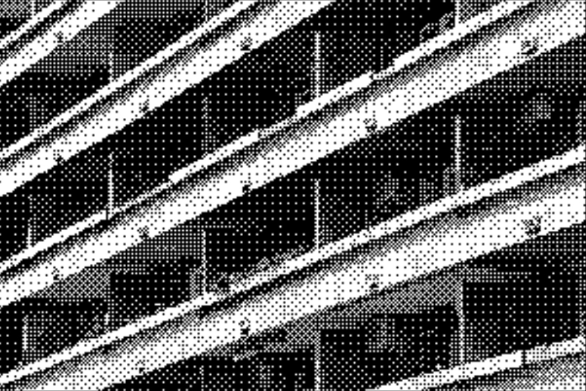
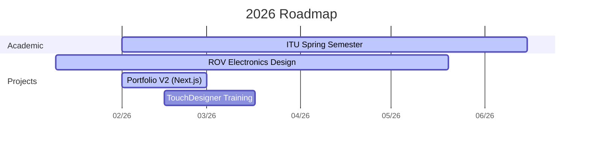

  

  <h1>⚡ Electrical & Electronics Engineering Student @ ITU</h1>
  
<i>"Merging Circuitry with Digital Artistry"</i>

  

    
    
    
  

---

## 🛰️ System Overview
I’m a multidisciplinary engineering student based in Istanbul. I currently focus on **embedded systems** in the **ITU ROV Team** while exploring the boundaries of visual programming.

My work sits at the intersection of raw hardware control and generative visuals.

---

## 🛠️ Tech Stack

| Engineering & Simulation | Creative & Web |
| :--- | :--- |
| ⚡ **Electronics:** LTspice, VHDL, Digital Logic | 🎨 **Visuals:** TouchDesigner, Analog Photography |
| 🔢 **Computation:** MATLAB, Complex Analysis | 🌐 **Web:** Next.js (Portfolio V2 in progress) |
| 🏗️ **Multiphysics:** COMSOL | 🎞️ **Art:** Glitch Art, Industrial Design |

---

## 🗺️ Current Objectives

---

## 🏛️ Aesthetics & Interests
- **Architecture:** Brutalism, Socialist Modernism, Industrial Design  
- **Visuals:** Analog Photography (35mm), Generative Design  
- **Audio:** Techno, IDM, Ambient  
- **Philosophy:** *"Form follows function, but chaos creates character."*

---

  
📫 Find me on <a href="https://www.linkedin.com">LinkedIn</a> or <a href="https://www.instagram.com">Instagram</a>

