  

  <h1>⚡ Electrical & Electronics Engineering Student @ ITU</h1>
  
<i>"Merging Circuitry with Digital Artistry"</i>

  

    
    
    
  

---

## 🛰️ System Overview
I’m a multidisciplinary engineering student based in Istanbul. I currently focus on **embedded systems** in the **ITU ROV Team** while exploring the boundaries of visual programming.

My work sits at the intersection of raw hardware control and generative visuals.

---

## 🛠️ Tech Stack

| Engineering & Simulation | Creative & Web |
| :--- | :--- |
| ⚡ **Electronics:** LTspice, VHDL, Digital Logic | 🎨 **Visuals:** TouchDesigner, Analog Photography |
| 🔢 **Computation:** MATLAB, Complex Analysis | 🌐 **Web:** Next.js (Portfolio V2 in progress) |
| 🏗️ **Multiphysics:** COMSOL | 🎞️ **Art:** Glitch Art, Industrial Design |

---

## 🗺️ Current Objectives

```mermaid
gantt
    title 2026 ROADMAP
    dateFormat YYYY-MM-DD
    axisFormat %m/%y

    section 🎓 Academic & edX
    ITU Spring Semester        :active, acad1, 2026-02-09, 2026-06-12
    CS50P (Python & OOP)       :active, edx1,  2026-02-02, 2026-07-01
    The Arch. Imagination      :active, edx2,  2026-02-02, 2026-04-10

    section 🚀 Projects & Dev
    ROV Electronics Design     :active, proj1, 2026-01-10, 2026-05-20
    Portfolio V2 (Next.js)     :done,   proj2, 2026-01-05, 2026-02-05
    TouchDesigner Training     :        art1,  2026-02-15, 30d
    Architecture App           :        proj3, 2026-04-01, 2026-07-31
```

---

## 🏛️ Aesthetics & Interests
- **Architecture:** Brutalism, Socialist Modernism, Industrial Design  
- **Visuals:** Analog Photography (35mm), Generative Design  
- **Audio:** Techno, IDM, Ambient  
- **Philosophy:** *"Form follows function, but chaos creates character."*

---

   
🌠Visit my website: <a href="https://duruduygu.com">duruduygu.com</a>

  
📫 Find me on <a href="[https://www.linkedin.com](https://www.linkedin.com/in/emir-duruduygu-90800a27a/)">LinkedIn</a> or <a href="[https://www.instagram.com](https://www.instagram.com/emir_duruduygu/?hl=en)">Instagram</a>

